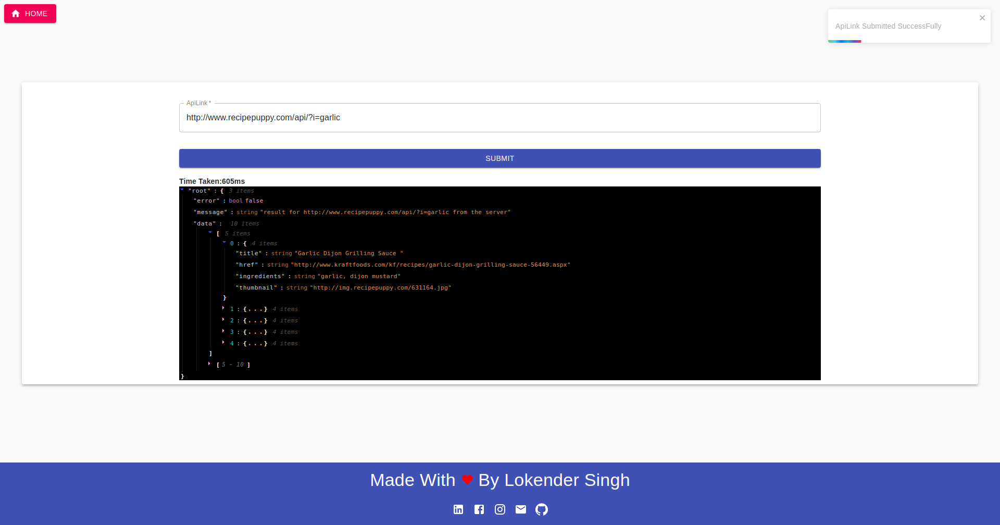
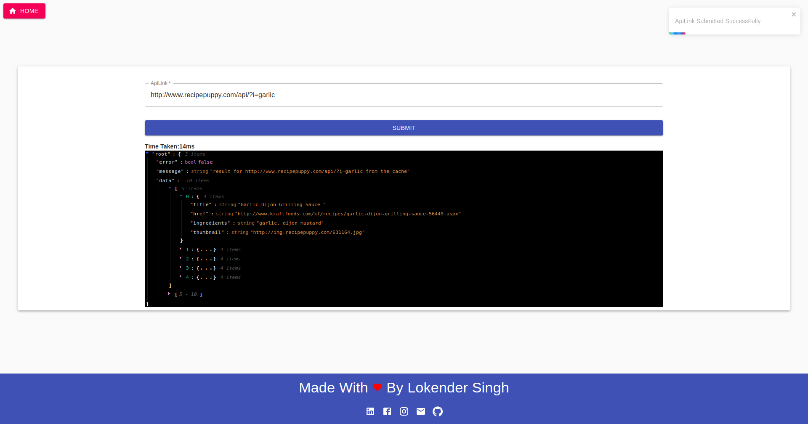

# SIMPLE_MERN_SHORT_DEMO_REDIS
It's a simple example or demo project to show server side cache operations
it's made by using following technologies
- ReactJS
- NodeJS
- MongoDB
- ExpressJS
- MaterialUI
- Redis

## How To Run 
```
- Redis
    sudo apt update

    sudo apt install redis-server

    sudo systemctl restart redis.service

    sudo systemctl status redis

    redis-cli
    
- Server
    1. Move To Server Directory
    cd server/

    2. Install Packages
    yarn

    3. start Server App
    nodemon src/server.js 

- Client    

    1. Move To Client Directory
    cd Client/

    2. Install Packages
    yarn

    3. start Server App
    yarn start
```


## Tasks Completed

1. Homepage
2. Form component
3. Basic server to handle Cache 

## Demo ScreenShots

- Server DB Request
  

- Server DB Request
  